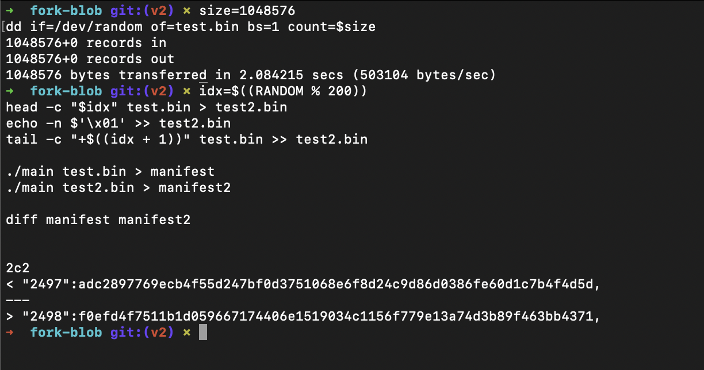
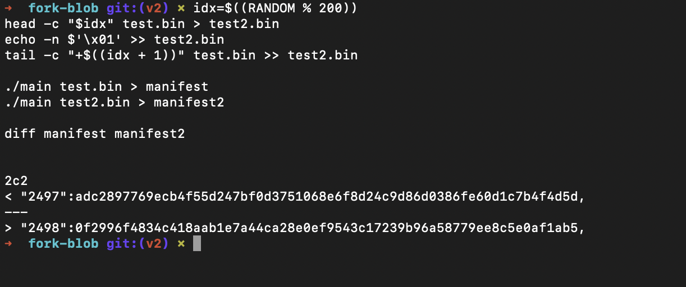
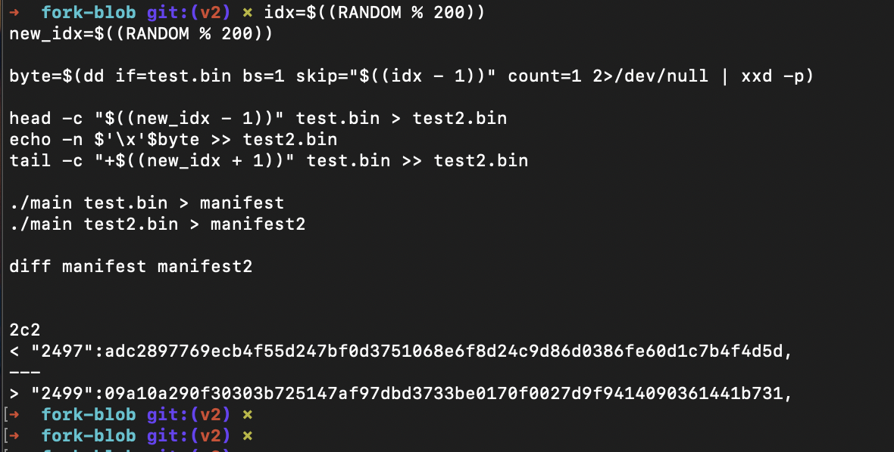

# fork-blob

### Решение было протестировано на файлах размера 1GB и 100MB, различие было только в 1 чанке, файлы были сгенерены

#### Пример для запуска теста с бинарником размера 1048576 байт ~1MB, который генерится:

```
bash test_insert.sh
```
```
bash test_change.sh
```
```
bash test_delete.sh
```
```
bash test_replace.sh
```
---
### Либо прогон тестов вручную на более больших файлах

#### Скомпилировать main.c в бинарник
```
gcc -I/opt/homebrew/opt/openssl/include -L/opt/homebrew/opt/openssl/lib -lcrypto -o main main.c
```

#### Сгенерировать файл 
```
size=1048576
dd if=/dev/random of=test.bin bs=1 count=$size

```
#### Вставить байт на рандом позицию

```
idx=$((RANDOM % 200))
head -c "$idx" test.bin > test2.bin
echo -n $'\x01' >> test2.bin
tail -c "+$((idx + 1))" test.bin >> test2.bin

./main test.bin > manifest
./main test2.bin > manifest2

diff manifest manifest2

```

Пример :


---
#### Удалить байт с рандомной позиции

```
idx=$((RANDOM % 200))
head -c "$idx" test.bin > test2.bin
echo -n $'\x01' >> test2.bin
tail -c "+$((idx + 1))" test.bin >> test2.bin

./main test.bin > manifest
./main test2.bin > manifest2

diff manifest manifest2

```
Пример :


---
#### Поставить байт на другую позицию

```
idx=$((RANDOM % 200))
new_idx=$((RANDOM % 200))

byte=$(dd if=test.bin bs=1 skip="$((idx - 1))" count=1 2>/dev/null | xxd -p)

head -c "$((new_idx - 1))" test.bin > test2.bin
echo -n $'\x'$byte >> test2.bin
tail -c "+$((new_idx + 1))" test.bin >> test2.bin

./main test.bin > manifest
./main test2.bin > manifest2

diff manifest manifest2

```
Пример :


